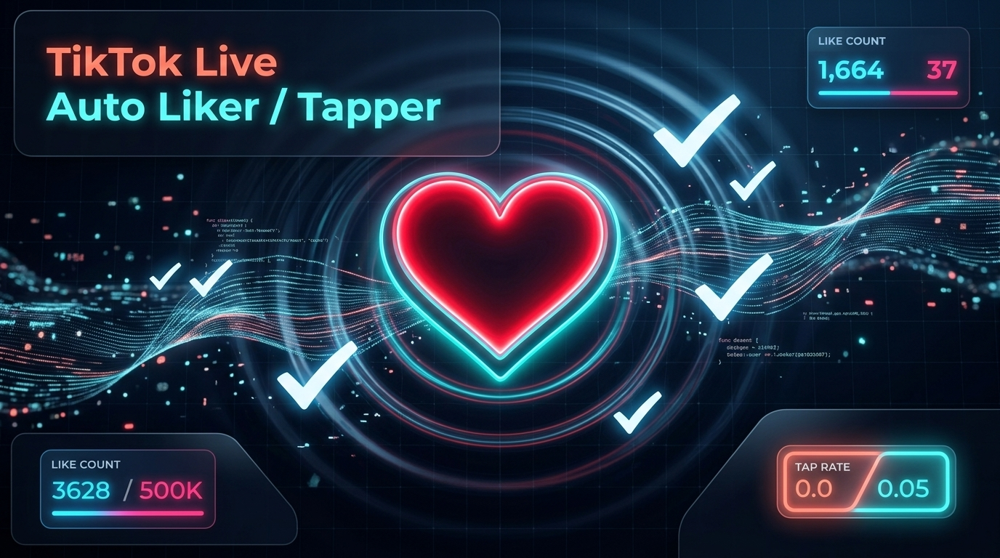
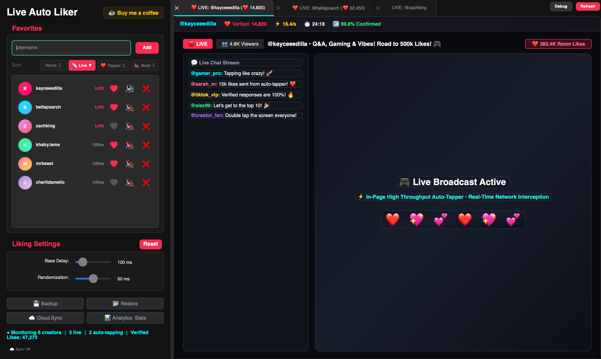
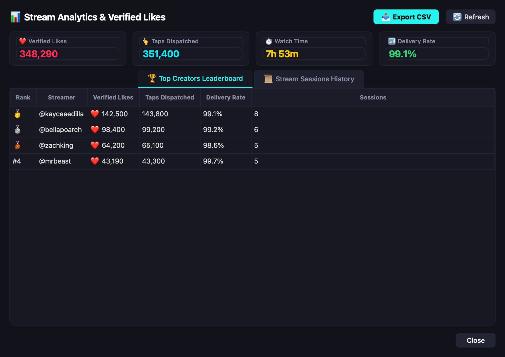
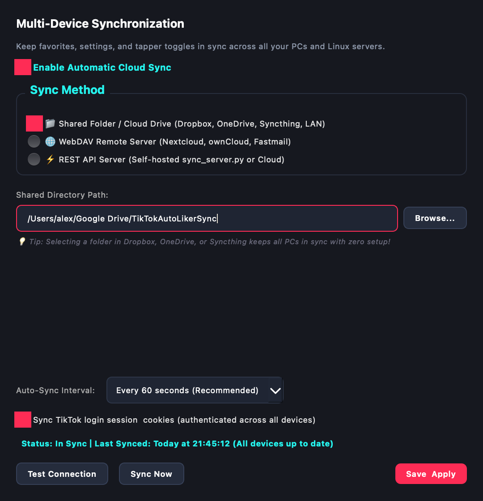
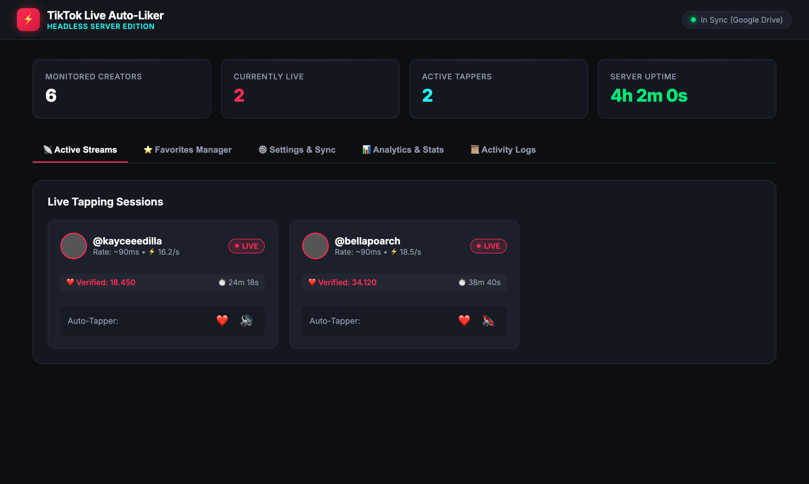
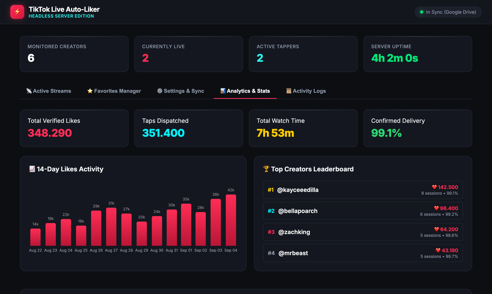
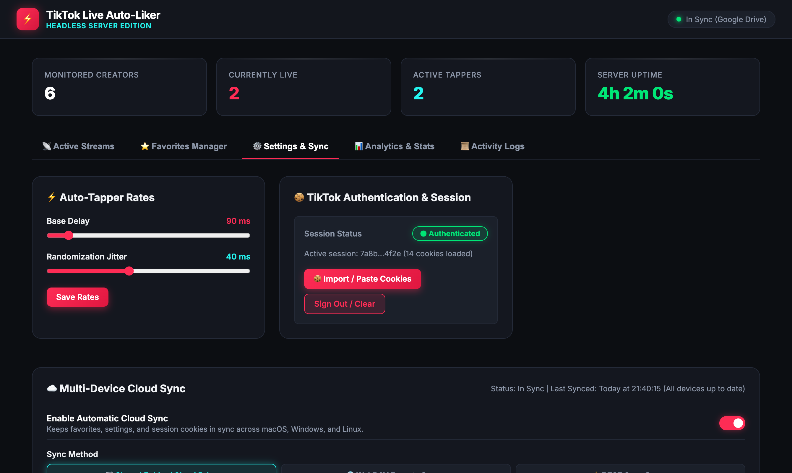

<div align="center">
  

  [](https://github.com/Crypto90/TikTok-Live-Auto-Liker-Tapper/releases)
  [](https://github.com/Crypto90/TikTok-Live-Auto-Liker-Tapper)
  [](https://python.org)
  [](LICENSE)
  [](https://ko-fi.com/K3K314GUP?ref=tiktok_live_auto_liker_readme)

  <br>

  <h1>⚡ TikTok Live Auto Liker / Tapper ⚡</h1>

  <p><b>High-Performance Desktop Application (macOS, Windows, Linux) & 24/7 Headless Linux Server</b></p>
  <p>100% Server-Verified Likes • Real-Time Stats Bar • Stream Session Lifecycle Tracking • Multi-Device Cloud Sync</p>
</div>

---

## 📸 Interface Previews

### 🖥️ PyQt6 Desktop Application (macOS, Windows, Linux)

<div align="center">
  
  <p><i>Live stream viewer with real-time floating verified stats bar, dynamic ticking tab titles, multi-criteria sorting, and per-creator audio toggles.</i></p>
</div>

<br>

<div align="center">
  <table>
    <tr>
      <td width="55%" align="center">
        <b>📊 Stream Analytics & Verified Likes Leaderboard</b>
        <br><br>
        
        <br>
        <small><i>KPI cards, ranked creator leaderboard, session logs & CSV export</i></small>
      </td>
      <td width="45%" align="center">
        <b>☁️ Multi-Device Cloud & Cookie Sync</b>
        <br><br>
        
        <br>
        <small><i>Google Drive, WebDAV, REST sync & TikTok session cookies</i></small>
      </td>
    </tr>
  </table>
</div>

---

### 🌐 24/7 Headless Linux Server & Responsive Web Dashboard

Run unmonitored on home servers, Raspberry Pi, or cloud VPS instances with a beautiful dark-mode browser dashboard on `http://server-ip:8080`.

<div align="center">
  
  <p><i>Tab 1 — <b>Active Streams</b>: Live throughput rates, verified like batches, elapsed timers, and stream controls.</i></p>
</div>

<br>

<div align="center">
  
  <p><i>Tab 4 — <b>Analytics & Stats</b>: 14-day interactive SVG activity bar chart, top creators leaderboard, and session history.</i></p>
</div>

<br>

<div align="center">
  
  <p><i>Tab 3 — <b>Settings & Sync</b>: In-browser cloud sync configuration, connection diagnostics, and authenticated TikTok cookie manager.</i></p>
</div>

---

## 🚀 Key Features

### 🎯 100% Server-Verified Like Counting
- **Dual Network Interception**: Transparently intercepts outgoing HTTP requests to `/webcast/room/like` and `/webcast/room/digg` across both `fetch` and `XMLHttpRequest`.
- **Response Validation**: Parses server payloads and verifies `status_code === 0` before registering likes. Failed requests and rate limits are tracked separately and excluded from totals.
- **Mathematical Accuracy**: Local UI displays instant dispatched clicks while the verified counter updates only on confirmed server acknowledgment.

### ⏱️ Live Floating Stats Bar & Dynamic Tabs
- **Glassmorphism Stats Bar**: Embedded directly above the live stream player displaying:
  - ❤️ **Verified Likes**: Live ticking counter updating with every acknowledged batch.
  - ⚡ **Rate**: Current live throughput (`likes/second`).
  - ⏱️ **Session Duration**: Active watch time timer (`mm:ss` / `hh:mm:ss`).
  - 📶 **Confirmed %**: Delivery confirmation percentage.
- **Dynamic Tab Badges**: Tab titles tick up live as likes are delivered: `❤️ LIVE: @streamer (❤️ 14,820)`.

### 📊 Deep Analytics & Export
- **4 Key Performance Indicators (KPIs)**: Total Verified Likes, Total Taps Dispatched, Total Stream Watch Time, and Global Confirmed Delivery Rate.
- **Top Creators Leaderboard**: Creators ranked by verified likes delivered with session counts, delivery accuracy, and last-active timestamps.
- **14-Day Activity Bar Chart**: Continuous daily activity chart visualizing likes sent and watch time trends.
- **Stream Sessions Lifecycle**: Automatically records when streamers go live, likes sent, and when they go offline.
- **📥 CSV Data Export**: One-click download of full session history and raw analytics logs.

### ☁️ Multi-Device Cloud Synchronization
- Keep all favorites, toggles (❤️), mute settings, and session statistics synchronized across **macOS**, **Windows gaming PCs**, and **Linux servers**:
  - **📁 Shared Folder / Cloud Drive**: Point to any folder inside your **Dropbox**, **Google Drive**, **OneDrive**, or **Syncthing** directory. Zero setup required!
  - **🌐 WebDAV**: Connect to **Nextcloud**, **ownCloud**, or **Fastmail**.
  - **⚡ REST API Server**: Self-hosted or centralized sync server with API key authorization.
- **🍪 Cross-Device TikTok Session & Cookie Sync**: Automatically synchronizes your authenticated TikTok login cookies (`sessionid`) so that background Linux servers like and tap directly under your personal TikTok account.
- Conflict-free Last-Write-Wins (LWW) resolution with deletion tombstones prevents race conditions.

### 🖥️ Native Browser Engine Architecture
- **macOS**: Native **Apple WebKit (`WKWebView`)** via `pyobjc-framework-WebKit` with hardware-accelerated H.264/HEVC/AAC video decoding and minimal CPU/memory footprint.
- **Windows**: **Microsoft Edge WebView2 (`qtwebview2`)** with low-memory Chromium flags.
- **Linux**: **`PyQt6-WebEngine`** with DocumentCreation codec shims for seamless TikTok Live player mounting.
- **Zero-Leak In-Page Engine**: Native JavaScript tapping loop executes directly in the DOM, eliminating IPC queue congestion and V8 heap growth (preventing Error 36 crashes). Floating heart animations are pruned automatically every 3 seconds.

---

## 💻 Installation & Quick Start

### 1. Clone the Repository
```bash
git clone https://github.com/Crypto90/TikTok-Live-Auto-Liker-Tapper.git
cd TikTok-Live-Auto-Liker-Tapper
```

### 2. Install Dependencies
```bash
pip install -r requirements.txt
```
*Platform-specific web engine bindings (WebKit on macOS, WebView2 on Windows) are resolved automatically.*

### 3. Run the Desktop Application
```bash
python tiktok_live_auto_liker_tapper.py
```

---

## 🖥️ Headless Linux Server Mode

For 24/7 unmonitored liking on a home server, Raspberry Pi, or cloud VPS:

### Run with Virtual Framebuffer (Xvfb)
```bash
# Direct runner:
xvfb-run -a python headless_runner.py --port 8080

# Or via main app CLI flag:
xvfb-run -a python tiktok_live_auto_liker_tapper.py --headless --port 8080
```

### Access the Web Dashboard
Open your browser and navigate to:
```
http://<your-server-ip>:8080
```

### Deploy with Docker
```bash
cd server
docker compose up -d
```

### Deploy with Systemd (Ubuntu / Debian / CentOS)
```bash
sudo cp server/tiktok-autoliker.service /etc/systemd/system/
sudo systemctl daemon-reload
sudo systemctl enable --now tiktok-autoliker
```

---

## ☁️ Multi-Device Sync Setup

1. In the desktop sidebar under **Data Management**, click **☁️ Cloud Sync** (or visit **Settings & Sync** in the Web Dashboard).
2. Check **Enable Automatic Cloud Sync**.
3. Choose your sync provider:
   - **📁 Shared Folder**: Select a folder inside Google Drive, Dropbox, OneDrive, or Syncthing.
   - **🌐 WebDAV**: Enter your Nextcloud / ownCloud server URL, username, and app password.
   - **⚡ REST API**: Enter your central sync server URL and API key.
4. Check **Sync TikTok login session & cookies** to enable authenticated headless liking.
5. Click **Test Connection**, then **Save & Apply**.

---

## 🔨 Building Standalone Executables (.app / .exe / binary)

A unified packaging script is included:

```bash
python build.py
```

### Output Artifacts:
- **macOS**: `dist/TikTokLiveAutoLiker.app` + `dist/Open_TikTokLiveAutoLiker.command` (Launcher that strips Gatekeeper quarantine on first run)
- **Windows**: `dist/TikTokLiveAutoLiker.exe` (Standalone executable)
- **Linux**: `dist/TikTokLiveAutoLiker` (Standalone 64-bit binary)

---

## 💖 Support Development

If you find this project useful, you can support development via Ko-fi:

[](https://ko-fi.com/K3K314GUP?ref=tiktok_live_auto_liker_readme)

---

## ⚖️ Disclaimer

This tool is for educational and research purposes only. Automated interaction with TikTok may violate their Terms of Service. Use responsibly.
